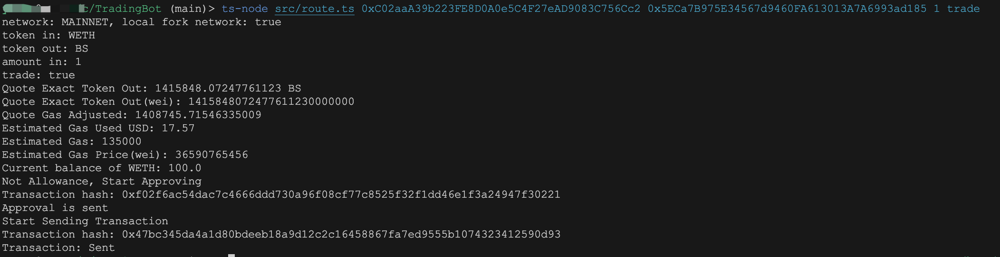
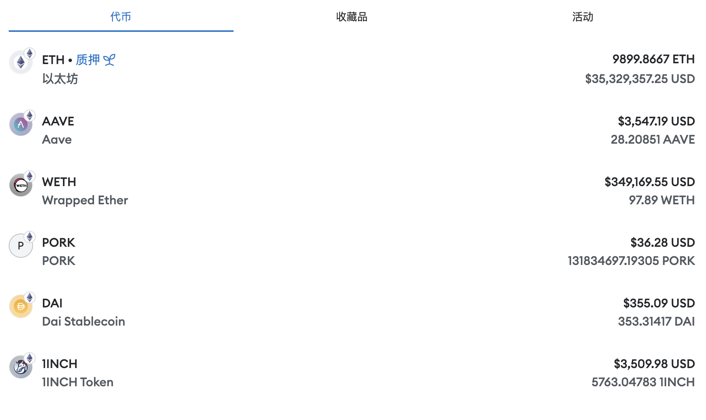

### Description

A trading tool in the Uniswap using [smart-order-router](https://github.com/Uniswap/smart-order-router)

### Environment

1. Run `npm install` to install dependencies

2. Create `.env` file and set `PRIVATE_KEY` and `JSON_RPC_PROVIDER`

3. Open new terminal run `npx hardhat node --network hardhat` to start local network.

   


### Wrap WETH

Because WETH is used as the local currency by default, you will not be able to trade if you do not have WETH in your account. You can use wrap_eth.ts to convert 100 ETH to WETH.

```javascript
ts-node wrap_eth.ts
```

### Usage

For v2 version(**outdated don't use**)  

Use 1 WETH to exchange for DAI. Currently v2 tokenIn is the default, and the WETH used can be modified later.  
The parameter is tokenOut

```javascript
// outdated don't use
ts-node src/trade_v2.js 0x6B175474E89094C44Da98b954EedeAC495271d0F   
```

For v3 version(**outdated don't use**)  
The parameters are tokenIn, tokenOut, amountIn, fee  
```javascript
// outdated don't use
ts-node src/trade_v3.ts 0xC02aaA39b223FE8D0A0e5C4F27eAD9083C756Cc2 0x38e68a37e401f7271568cecaac63c6b1e19130b4 1 1000
0
```

For smart-order-router(**recommend**)  


```javascript
// ts-node src/route.ts tokenIn tokenOut amountIn
// quote 10000 tokens for WETH
ts-node src/route.ts 0x42bbfa2e77757c645eeaad1655e0911a7553efbc 0xC02aaA39b223FE8D0A0e5C4F27eAD9083C756Cc2 10000 
```

If you want to trade  

```javascript
// ts-node src/route.ts tokenIn tokenOut amountIn trade
// trade 1 WETH for BS
ts-node src/route.ts 0xC02aaA39b223FE8D0A0e5C4F27eAD9083C756Cc2 0x5ECa7B975E34567d9460FA613013A7A6993ad185 1 trade
```
Quote and Trade Log Info  
  

You can connect your metamask to your local test network, so that your can see the balance of the tokens   

    


  


### Note

All code has only been tested on the local test network and is for learning purposes only.**Use this code to trade at your own risk.**

